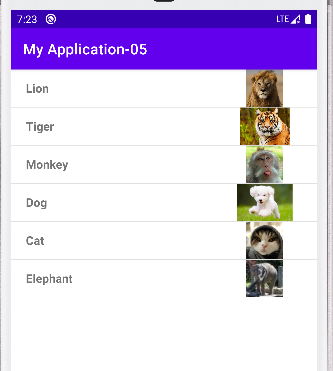
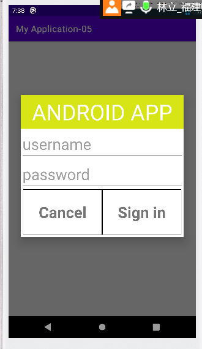
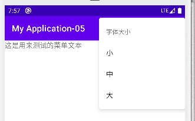
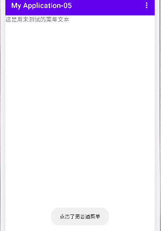
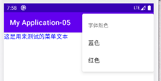

#第三次实验
## 实验1 listView 列表项
### 1.基本思路 
通过SimpleAdapter 或者继承baseAdapter实现
### 2.结果示意

### 3.关键代码
#### 布局文件
    <LinearLayout xmlns:android="http://schemas.android.com/apk/res/android"
    android:layout_width="match_parent"
    android:layout_height="match_parent"
    android:orientation="vertical"
    >
        <ListView
        android:id="@+id/lv_list"
        android:layout_width="match_parent"
        android:layout_height="wrap_content"
        >
    </ListView>
    </LinearLayout>
#### 列表Item
    <TextView
        android:id="@+id/tx_name"
        android:layout_width="0dp"
        android:layout_weight="3"
        android:layout_height="match_parent"
        android:gravity="left|center_vertical"
        android:textSize="16sp"
        android:paddingLeft="20dp"
        android:textStyle="bold" />
    <ImageView
        android:id="@+id/tx_img"
        android:layout_width="50dp"
        android:layout_height="50dp"
        android:layout_weight="1"
        android:contentDescription="aa"
        app:srcCompat="@drawable/cat"
       />
#### 适配器类
    public class listAdapter extends BaseAdapter {
    private Context mContext;
    private List<bean> beans;

    public listAdapter(Context mContext, List<bean> beans) {
        this.mContext = mContext;
        this.beans = beans;
    }

    @Override
    public int getCount() {
        return beans.size();
    }

    @Override
    public Object getItem(int i) {
        return beans.get(i);
    }

    @Override
    public long getItemId(int i) {
        return i;
    }

    @Override
    public View getView(int i, View view, ViewGroup viewGroup) {
        Holder holder;
       if(view==null){
           view=LayoutInflater.from(this.mContext).inflate(R.layout.list_item,null);
           holder=new Holder();
          holder.tv= view.findViewById(R.id.tx_name);
          holder.img= view.findViewById(R.id.tx_img);
          view.setTag(holder);
       }else {
           holder=(Holder) view.getTag();
       }
        bean Bean= beans.get(i);
        holder.tv.setText(Bean.getTx_view());
        holder.img.setImageResource(Bean.getIm_image());
        return view;
    }
    public class  Holder{
        public ImageView img;
        public TextView tv;
    }
#### 获取数据
     public static  String[] text={"Lion","Tiger","Monkey","Dog","Cat","Elephant"};
     public static  int[] images={R.drawable.lion,R.drawable.tiger,R.drawable.monkey,R.drawable.dog,R.drawable.cat,R.drawable.elephant};
    
    public static List<bean> setDefaultList(){
        List<bean> lb=new ArrayList<>();
        for (int i = 0; i < text.length; i++) {
            System.out.println(i);
           lb.add(new bean(text[i],images[i]));
        }
        return  lb;
    }
#### 在OnCreate内使用适配器，以及实现事件监听
    ListView list = findViewById(id.lv_list);
    //        ListView Lview = findViewById(id.lv_list);
    //        ImageView img = findViewById(id.tx_img);
    //        TextView name = findViewById(id.tx_name);

        list.setAdapter(new listAdapter(this, bean.setDefaultList()));
        list.setOnItemClickListener((adapterView, view, i, l) -> {

            if(be_selected_item != i){
                adapterView.getChildAt(be_selected_item).setBackgroundColor(Color.parseColor("#ffffff"));
                view.setBackgroundColor(Color.RED);
                Toast toast = Toast.makeText(MainActivity.this, bean.text[i], Toast.LENGTH_LONG);
                toast.setGravity(Gravity.BOTTOM|Gravity.CENTER_HORIZONTAL , 0, 0);
                TextView v = (TextView) toast.getView().findViewById(android.R.id.message);
                v.setTextColor(Color.BLACK);
                toast.show();
                //刷新被选中item的编号
                be_selected_item = i;
            }
        });
## 实验二 创建自定义布局的AlertDialog
### 1.结果示意

### 2.基本思路
AlertDialog.Builder 生成对话框，在布局文件内定义样式
### 关键代码

#### 布局文件
    <LinearLayout xmlns:android="http://schemas.android.com/apk/res/android"
        android:layout_width="match_parent"
        android:layout_height="match_parent"
        android:gravity="center"
        android:background="@android:color/transparent"
        android:orientation="vertical">
    
        <TextView
            android:id="@+id/textView"
            android:layout_width="match_parent"
            android:layout_height="75dp"
            android:background="#D7E516"
            android:gravity="center"
            android:text="ANDROID APP"
            android:textColor="@android:color/white"
            android:textSize="48sp" />
    
        <EditText
            android:id="@+id/et_name"
            android:layout_width="match_parent"
            android:layout_height="wrap_content"
            android:hint="username"
    
            android:textSize="34sp" />
    
        <EditText
            android:id="@+id/et_pwd"
            android:layout_width="match_parent"
            android:layout_height="wrap_content"
            android:hint="password"
    
            android:textSize="34sp" />
    
        <LinearLayout
            android:layout_width="match_parent"
            android:layout_height="wrap_content"
            android:layout_marginBottom="5dp"
            android:orientation="horizontal"
            android:paddingLeft="5dp"
            android:paddingRight="5dp">
    
    
            <TextView
                android:id="@+id/textView2"
                android:layout_width="0dp"
                android:layout_height="100dp"
                android:layout_weight="1"
                android:gravity="center"
                android:text="Cancel"
                android:textSize="34sp"
                android:background="@drawable/bg_btu"
                android:textStyle="bold" />
    
            <TextView
                android:id="@+id/textView3"
                android:layout_width="0dp"
                android:layout_height="100dp"
                android:layout_weight="1"
                android:gravity="center"
                android:text="Sign in"
                android:textSize="34sp"
                android:background="@drawable/bg_btu"
                android:textStyle="bold" />
        </LinearLayout>
    </LinearLayout>
#### onCreate函数内部
    AlertDialog.Builder builder=new AlertDialog.Builder(this);
        AlertDialog alertDialog = builder.create();
        View login= View.inflate(this,R.layout.dialog_view,null);
        alertDialog.setView(login);
        alertDialog.show();

## 实验三 使用XML定义菜单
### 实验思路
    1.在layout/menu文件夹下建立菜单布局文件，一级菜单和二级菜单
        <menu xmlns:app="http://schemas.android.com/apk/res-auto"
        xmlns:android="http://schemas.android.com/apk/res/android">
        <item android:title="字体大小"
        android:id="@+id/textSize">
        <menu>
        <item android:id="@+id/small"
        android:title="小">
        </item >
        <item android:id="@+id/meudin"
        android:title="中">
        </item>
        <item android:id="@+id/big"
        android:title="大">
        </item>
        </menu>
        </item>
        <item android:title="普通菜单项"
        android:id="@+id/putong"/>
        <item android:title="字体颜色"
        android:id="@+id/textColor">
        <menu>
        <item
        android:title="蓝色"
        android:id="@+id/blue" />
        <item
        android:title="红色"
        android:id="@+id/red" />
        </menu>
        </item>
        </menu>
    2.重写onCreateOptionsMenu以及OnMenuOpen
    protected void onCreate(Bundle savedInstanceState) {
        super.onCreate(savedInstanceState);
        setContentView(R.layout.activity_main3);
        mTextView=findViewById(R.id.testText);
    }
    //该方法用于创建显示Menu
    @Override
    public boolean onCreateOptionsMenu(Menu menu) {
    getMenuInflater().inflate(R.menu.my_menu,menu);
    return true;
    }
    //选项菜单打开以后会调用这个方法，设置menu图标显示（icon）
    @Override
    public boolean onMenuOpened(int featureId, Menu menu) {
    if (menu != null) {
    if (menu.getClass().getSimpleName().equalsIgnoreCase("MenuBuilder")) {
    try {
    Method method = menu.getClass().getDeclaredMethod("setOptionalIconsVisible", Boolean.TYPE);
    method.setAccessible(true);
    method.invoke(menu, true);
    } catch (Exception e) {
    e.printStackTrace();
    }
    }
    }
    return super.onMenuOpened(featureId, menu);
    }
#### 设置事件监听
    @Override
        public boolean onOptionsItemSelected(@NonNull MenuItem item) {

            switch (item.getItemId()) {
                case R.id.small:
                    mTextView.setTextSize(10);
                    break;
                case R.id.meudin:
                    mTextView.setTextSize(16);
                    break;
                case R.id.big:
                    mTextView.setTextSize(24);
                    break;
                case R.id.putong:
                    Toast.makeText(this, "点击了第普通菜单", Toast.LENGTH_SHORT).show();
                    break;
                case R.id.blue:
                    mTextView.setTextColor(Color.BLUE);
                    break;
                case R.id.red:
                    mTextView.setTextColor(Color.RED);
                    break;
            }
            return super.onOptionsItemSelected(item);
        }
    }
### 结果截图

#### 

    
