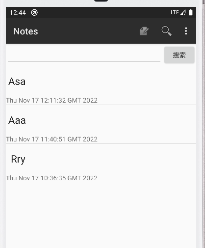
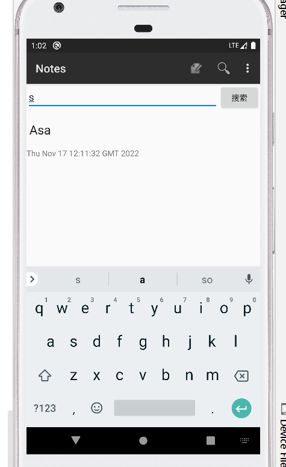
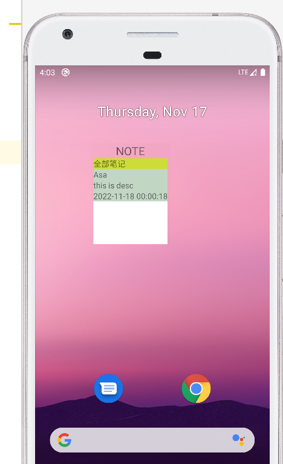
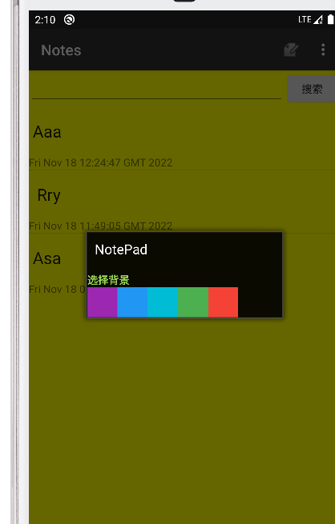
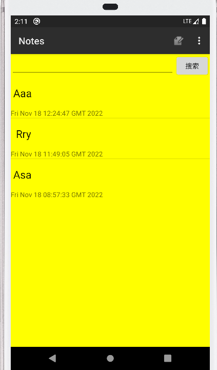

#期中实验
##功能1  添加时间戳功能
### 1.在java/com/example/android/notepad/NoteEditor文件内部将
     values.put(NotePad.Notes.COLUMN_NAME_MODIFICATION_DATE, System.currentTimeMillis());
### 改为
    values.put(NotePad.Notes.COLUMN_NAME_MODIFICATION_DATE, String.valueOf(new Date()));

即在数据库内存储时间类型数据，而非时间戳
### 2.修改布局文件 在 noteslist_item修改布局文件，添加如下代码
    <TextView
        android:id="@+id/update_time"
        android:layout_width="match_parent"
        android:layout_height="wrap_content"
        android:text="时间">

    </TextView>
### 3.在com/example/android/notepad/NotesList.java类内部修改显示,在里面添加事件相关的字段
    private static final String[] PROJECTION = new String[] {
            NotePad.Notes._ID, // 0
            NotePad.Notes.COLUMN_NAME_TITLE,
            NotePad.Notes.COLUMN_NAME_MODIFICATION_DATE// 1
    };
    
    ***
    String[] dataColumns = { NotePad.Notes.COLUMN_NAME_TITLE ,NotePad.Notes.COLUMN_NAME_MODIFICATION_DATE} ;
    int[] viewIDs = { android.R.id.text1 ,R.id.update_time};
### 4.结果截图

## 功能二 搜索功能

### 1.添加搜索框和搜索按钮的布局文件
    <?xml version="1.0" encoding="utf-8"?>
    <LinearLayout xmlns:android="http://schemas.android.com/apk/res/android"
        android:layout_width="match_parent"
        android:layout_height="match_parent"
        android:orientation="vertical">
            <LinearLayout
            android:layout_width="match_parent"
            android:layout_height="wrap_content"
            android:orientation="horizontal">
                <EditText
                android:id="@id/search_bar"
                android:layout_height="wrap_content"
                android:layout_width="match_parent"
                android:layout_weight="5" >
                </EditText>
                <Button
                    android:id="@+id/search_button"
                    android:text="搜索"
                    android:layout_width="wrap_content"
                    android:layout_height="wrap_content"
                    android:layout_weight="1">
                </Button>
            </LinearLayout>
            <ListView
                android:layout_width="wrap_content"
                android:layout_height="wrap_content"
                android:id="@android:id/list"
            >
            </ListView>
    </LinearLayout>
### 2.为按钮添加事件监听，在java/com/example/android/notepad/NotesList.java添加如下代码
     ListView listView = findViewById(android.R.id.list);
        Search  = findViewById(R.id.search_button);
        EditText editText = findViewById(R.id.search_bar);
        Search.setOnClickListener(new View.OnClickListener() {
            @Override
            public void onClick(View v) {
                查询条件
                String SELENTION="title like ?";
                //模糊查询
                String[] SELENTIONARGS={"%"+editText.getText()+"%"};
                //获取游标
                Cursor cursor = getContentResolver().query(
                        getIntent().getData(),
                        PROJECTION,
                        SELENTION,
                        SELENTIONARGS,
                        NotePad.Notes.DEFAULT_SORT_ORDER);
                String[] dataColumns = { NotePad.Notes.COLUMN_NAME_TITLE ,NotePad.Notes.COLUMN_NAME_MODIFICATION_DATE} ;
                int[] viewIDs = { android.R.id.text1 ,R.id.update_time};
                //为列表添加适配器
                SimpleCursorAdapter adapter
                        = new SimpleCursorAdapter(
                        NotesList.this,                             // The Context for the ListView
                        R.layout.noteslist_item,          // Points to the XML for a list item
                        cursor,                           // The cursor to get items from
                        dataColumns,
                        viewIDs
                );
                listView.setAdapter(adapter);
            }
        });
### 3.结果截图

## 3.功能三 桌面小组件

### 1. 添加组件布局文件
    <?xml version="1.0" encoding="utf-8"?>
    <LinearLayout
    xmlns:android="http://schemas.android.com/apk/res/android" android:layout_width="match_parent"
    android:layout_height="match_parent"
    android:gravity="center"
    android:background="@color/cardview_shadow_end_color"
    android:orientation="vertical">
        <TextView
        android:id="@+id/tv"
        android:layout_width="wrap_content"
        android:layout_height="wrap_content"
        android:textSize="20sp"
        android:text="NOTE"/>
        <ListView
            android:layout_width="match_parent"
            android:id="@android:id/widget_frame"
            android:layout_height="wrap_content">
        </ListView>
    </LinearLayout>

### 列表项布局文件
    <?xml version="1.0" encoding="utf-8"?>
    <LinearLayout xmlns:android="http://schemas.android.com/apk/res/android"
    android:layout_width="match_parent"
    android:layout_height="match_parent"
    android:background="#FFFFFF"
    android:orientation="vertical">
        <TextView
            android:id="@+id/textView"
            android:layout_width="match_parent"
            android:layout_height="wrap_content"
            android:background="#CDDC39"
            android:text="全部笔记" />
        <LinearLayout
            android:layout_width="wrap_content"
            android:layout_height="wrap_content"
            android:background="#C2D6C4"
            android:orientation="vertical">
            <TextView
                android:id="@+id/title"
                android:layout_width="match_parent"
                android:layout_height="wrap_content"
                android:text="标题" />
            <TextView
                android:id="@+id/desc"
                android:layout_width="match_parent"
                android:layout_height="wrap_content"
                android:text="desc" />
            <TextView
                android:id="@+id/time"
                android:layout_width="match_parent"
                android:layout_height="wrap_content"
                android:text="时间" />
        </LinearLayout>
    </LinearLayout>

### 2.添加provider文件

    public class ListWidgetProvider extends AppWidgetProvider {
    
        //定义一个action，这个action要在AndroidMainfest中去定义，不然识别不到，名字是自定义的
        private static final String CLICK_ACTION = "com.barry.widgetapp.plus.CLICK";
    
        //onReceive不存在widget生命周期中，它是用来接收广播，通知全局的
        @Override
        public void onReceive(Context context, Intent intent) {
            super.onReceive(context, intent);
            AppWidgetManager appWidgetManager = AppWidgetManager.getInstance(context);
            //当我们点击桌面上的widget按钮（这个按钮我们在onUpdate中已经为它设置了监听），widget就会发送广播
            //这个广播我们也在onUpdate中为它设置好了意图，设置了action，在这里我们接收到对应的action并做相应处理
            if (intent.getAction().equals(CLICK_ACTION)) {
                Toast.makeText(context,"click",Toast.LENGTH_SHORT).show();
                //因为点击按钮后要对布局中的文本进行更新，所以需要创建一个远程view
                RemoteViews remoteViews = new RemoteViews(context.getPackageName(),R.layout.widget_layout);
                //为对应的TextView设置文本
                remoteViews.setTextViewText(R.id.tv, "按钮已经点击");
                //更新widget
                appWidgetManager.updateAppWidget(new ComponentName(context,ListWidgetProvider.class),remoteViews);
            }
        }
    
        //当widget第一次添加到桌面的时候回调，可添加多次widget，但该方法只回调一次
        @Override
        public void onEnabled(Context context) {
            super.onEnabled(context);
            Toast.makeText(context,"创建成功",Toast.LENGTH_SHORT).show();
        }
    
        //当widget被初次添加或大小被改变时回调
        @Override
        public void onAppWidgetOptionsChanged(Context context, AppWidgetManager appWidgetManager, int appWidgetId, Bundle newOptions) {
            super.onAppWidgetOptionsChanged(context, appWidgetManager, appWidgetId, newOptions);
        }
    
        /**
         * 当widget更新时回调
         *
         * @param context
         * @param appWidgetManager
         * @param appWidgetIds      这个数组使用用来存储已经创建的widget的id，因为可能创建了多个widget
         */
        @Override
        public void onUpdate(Context context, AppWidgetManager appWidgetManager,
                             int[] appWidgetIds) {
            // 获取Widget的组件名
            ComponentName thisWidget = new ComponentName(context,
                    ListWidgetProvider.class);
    
            // 创建一个RemoteView
            RemoteViews remoteViews = new RemoteViews(context.getPackageName(),
                    R.layout.widget_layout);
    
            // 把这个Widget绑定到RemoteViewsService
            Intent intent = new Intent(context, MyRemoteViewsService.class);
            intent.putExtra(AppWidgetManager.EXTRA_APPWIDGET_ID, appWidgetIds[0]);
    
            // 设置适配器
            remoteViews.setRemoteAdapter(android.R.id.widget_frame, intent);
    
            // 设置当显示的widget_list为空显示的View
    //        remoteViews.setEmptyView(R.id.widget_list, R.layout.none_data);
    
            // 点击列表触发事件
            Intent clickIntent = new Intent(context, ListWidgetProvider.class);
            // 设置Action，方便在onReceive中区别点击事件
            clickIntent.setData(Uri.parse(clickIntent.toUri(Intent.URI_INTENT_SCHEME)));
    
            PendingIntent pendingIntentTemplate = PendingIntent.getBroadcast(
                    context, 0, clickIntent, PendingIntent.FLAG_UPDATE_CURRENT);
    
            remoteViews.setPendingIntentTemplate(android.R.id.widget_frame,
                    pendingIntentTemplate);
    
            // 刷新按钮
            final Intent refreshIntent = new Intent(context,
                    ListWidgetProvider.class);
            refreshIntent.setAction("refresh");
            final PendingIntent refreshPendingIntent = PendingIntent.getBroadcast(
                    context, 0, refreshIntent, PendingIntent.FLAG_UPDATE_CURRENT);
    
    
            // 更新Wdiget
            appWidgetManager.updateAppWidget(thisWidget, remoteViews);
    
        }
    
        //当 widget 被删除时回调
        @Override
        public void onDeleted(Context context, int[] appWidgetIds) {
            super.onDeleted(context, appWidgetIds);
        }
        //当最后一个widget实例被删除时回调.
        @Override
        public void onDisabled(Context context) {
            super.onDisabled(context);
        }
    
    }
### 3.添加remote view 的适配器factory
    public class MyRemoteViewsFactory implements RemoteViewsService.RemoteViewsFactory {

        private final Context mContext;
        public static List<String> mList = new ArrayList<String>();
        public static List<String> titles = new ArrayList<String>();
        public static List<String> descs = new ArrayList<String>();
        public static List<String> times = new ArrayList<String>();

   
        public MyRemoteViewsFactory(Context context, Intent intent) {
    
            mContext = context;
        }
    
        /*
         * MyRemoteViewsFactory调用时执行，这个方法执行时间超过20秒回报错。
         * 如果耗时长的任务应该在onDataSetChanged或者getViewAt中处理
         */
        @Override
        public void onCreate() {
            NotePadProvider.DatabaseHelper databaseHelper = new NotePadProvider.DatabaseHelper(mContext);
            SQLiteQueryBuilder qb = new SQLiteQueryBuilder();
            qb.setTables(NotePad.Notes.TABLE_NAME);
            SQLiteDatabase db = databaseHelper.getReadableDatabase();
            String orderBy = NotePad.Notes.DEFAULT_SORT_ORDER;
            String[] projection = new String[]{
                    NotePad.Notes._ID, // 0
                    NotePad.Notes.COLUMN_NAME_TITLE,
                    NotePad.Notes.COLUMN_NAME_MODIFICATION_DATE,// 1
                    NotePad.Notes.COLUMN_NAME_NOTE
            };
            Cursor c = qb.query(
                    db,            // The database to query
                    projection,    // The columns to return from the query
                    null,     // The columns for the where clause
                    null, // The values for the where clause
                    null,          // don't group the rows
                    null,          // don't filter by row groups
                    orderBy       // The sort order
            );
    
            if (c.moveToFirst()) {
                do {
                    @SuppressLint("Range") String title = c.getString(c.getColumnIndex(NotePad.Notes.COLUMN_NAME_TITLE));
                    @SuppressLint("Range") String desc = c.getString(c.getColumnIndex(NotePad.Notes.COLUMN_NAME_NOTE));
                    @SuppressLint("Range") String time = c.getString(c.getColumnIndex(NotePad.Notes.COLUMN_NAME_MODIFICATION_DATE));
                    titles.add(title);
                    descs.add(desc);
                    times.add(time);
                }
                while (c.moveToNext());
            }
            System.out.println(titles);
        }
        @Override
        public void onDataSetChanged() {
        }
        @Override
        public void onDestroy() {
            mList.clear();
        }
        @Override
        public int getCount() {
            return mList.size();
        }
        @Override
        public RemoteViews getViewAt(int position) {
            RemoteViews views = new RemoteViews(mContext.getPackageName(), R.layout.widget_list_item_tv);
            views.setTextViewText(R.id.title, titles.get(position));
            views.setTextViewText(R.id.desc, descs.get(position));
            views.setTextViewText(R.id.time, times.get(position));
            return views;
        }
        @Override
        public RemoteViews getLoadingView() {
            return null;
        }
        @Override
        public int getViewTypeCount() {
            return 1;
        }
        @Override
        public long getItemId(int position) {
            return position;
        }
        @Override
        public boolean hasStableIds() {
            return true;
        }
    }
### 4.添加 RemoteViewsService
    @TargetApi(Build.VERSION_CODES.HONEYCOMB)
    public class MyRemoteViewsService extends RemoteViewsService {
        @Override
        public RemoteViewsService.RemoteViewsFactory onGetViewFactory(Intent intent) {
            return new MyRemoteViewsFactory(this.getApplicationContext(), intent);
        }
    }
### 5.配置文件
    <?xml version="1.0" encoding="utf-8"?>
    <appwidget-provider xmlns:android="http://schemas.android.com/apk/res/android"
        android:minHeight="180dp"
        android:minWidth="300dp"
        android:initialLayout="@layout/widget_layout"
        android:updatePeriodMillis="50000"
        android:resizeMode="horizontal|vertical"
        android:widgetCategory="home_screen">
    </appwidget-provider>
### 6. main_list.xml添加
    <receiver android:name=".ListWidgetProvider"
            android:exported="true">
            <intent-filter>
                <!--这个必须声明-->
                <action android:name="android.appwidget.action.APPWIDGET_UPDATE" />
                <!--这个和SimpleWidgetProvider中的CLICK_ACTION对应-->
                <action android:name="com.barry.widgetapp.CLICK"/>
            </intent-filter>
            <!--指定AppWidgetProviderInfo资源XML文件-->
            <meta-data
                android:name="android.appwidget.provider"
                android:resource="@xml/widget_provider" />
        </receiver>
### 7.结果展示

## 功能四,修改背景颜色

### 1. 添加菜单,和布局文件
    <?xml version="1.0" encoding="utf-8"?>
    <LinearLayout xmlns:android="http://schemas.android.com/apk/res/android"
    xmlns:tools="http://schemas.android.com/tools"
    android:layout_width="900px"
    android:layout_height="match_parent"
    android:orientation="vertical">
        <TextView
            android:layout_width="wrap_content"
            android:layout_height="wrap_content"
            android:gravity="center"
            android:text="选择背景"
            android:textAlignment="center"
            android:textColor="#9AD856"
            android:textStyle="bold" />
        <LinearLayout
            android:layout_width="match_parent"
            android:layout_height="wrap_content"
            android:orientation="horizontal">
    
            <Button
                android:id="@+id/button1"
                android:layout_width="40dp"
                android:layout_height="40dp"
                android:background="#9C27B0"></Button>
    
            <Button
                android:id="@+id/button2"
                android:layout_width="40dp"
                android:layout_height="40dp"
                android:background="#2196F3"></Button>
    
            <Button
                android:id="@+id/button3"
                android:layout_width="40dp"
                android:layout_height="40dp"
                android:background="#00BCD4"></Button>
    
            <Button
                android:id="@+id/button4"
                android:layout_width="40dp"
                android:layout_height="40dp"
                android:background="#4CAF50"></Button>
    
            <Button
                android:id="@+id/button5"
                android:layout_width="40dp"
                android:layout_height="40dp"
                android:background="#F44336"></Button>
        </LinearLayout>
    </LinearLayout>

### 编写activity
    public class BackgroundEdit extends Activity {
        @Override
        protected void onCreate(Bundle savedInstanceState) {
            super.onCreate(savedInstanceState);
            setContentView(R.layout.activity_background_edit);
             Button button1= findViewById(R.id.button1);
            Button button2= findViewById(R.id.button2);
            Button button3= findViewById(R.id.button3);
            Button button4= findViewById(R.id.button4);
            Button button5= findViewById(R.id.button5);
            button1.setOnClickListener(new View.OnClickListener() {
                @Override
                public void onClick(View view) {
                    Intent intent = new Intent(BackgroundEdit.this,NotesList.class);
                    setResult(0,intent);
                    finish();
                }
            });
            button2.setOnClickListener(new View.OnClickListener() {
                @Override
                public void onClick(View view) {
                    Intent intent = new Intent();
                    setResult(1,intent);
                    finish();
                }
            });
            button3.setOnClickListener(new View.OnClickListener() {
                @Override
                public void onClick(View view) {
                    Intent intent = new Intent();
                    setResult(2,intent);
                    finish();
                }
            });
            button4.setOnClickListener(new View.OnClickListener() {
                @Override
                public void onClick(View view) {
                    Intent intent = new Intent();
                    setResult(3,intent);
                    finish();
                }
            });
            button5.setOnClickListener(new View.OnClickListener() {
                @Override
                public void onClick(View view) {
                    Intent intent = new Intent();
                    setResult(4,intent);
                    finish();
                }
            });
        }
    }
### 3. 在NOTESLIst 内添加回调函数
     //从第二个页面回来的时候会执行 onActivityResult 这个方法
    @Override
    protected void onActivityResult(int requestCode, int resultCode, Intent data) {
        linearLayout= findViewById(R.id.main);
        switch (requestCode){
            case 0:
                linearLayout.setBackgroundColor(Color.BLUE);
            case 1:
                linearLayout.setBackgroundColor(Color.GREEN);
            case 2:
                linearLayout.setBackgroundColor(Color.RED);
            case 3:
                linearLayout.setBackgroundColor(Color.parseColor("#566566"));
            case 4:
                linearLayout.setBackgroundColor(Color.YELLOW);
        }
    }
### 4. 界面展示

    